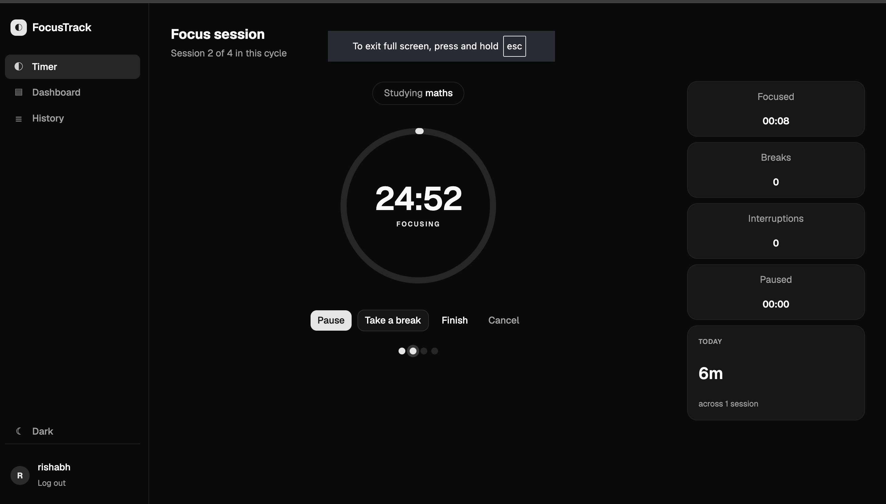
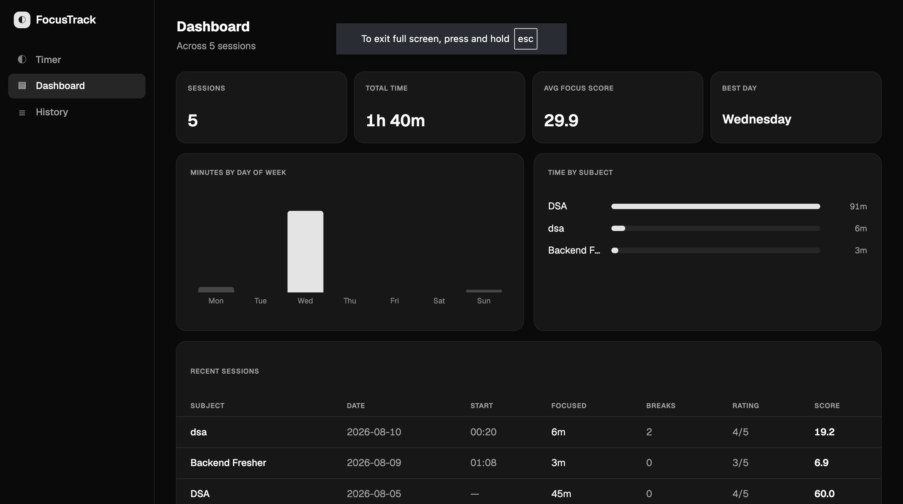
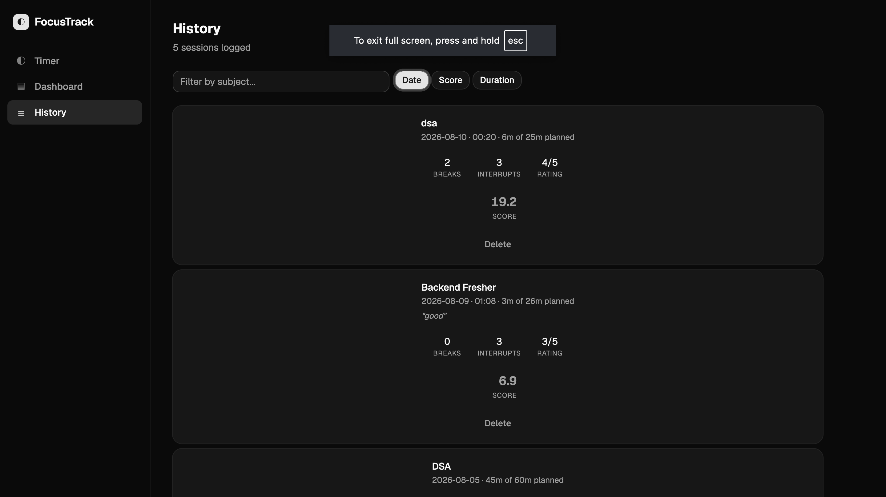
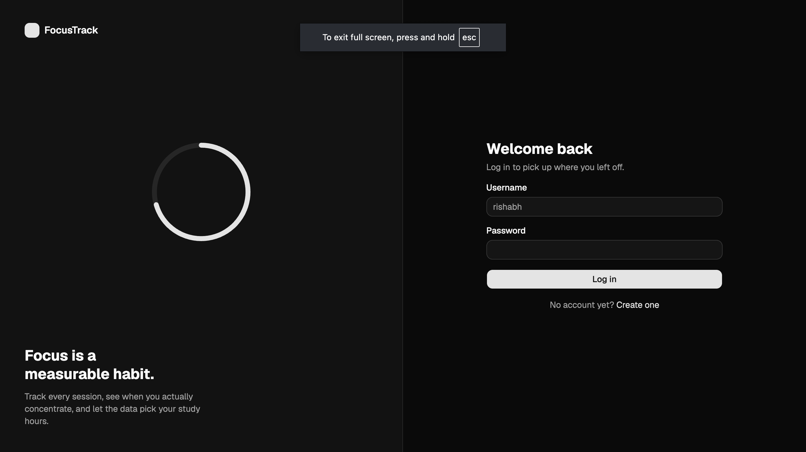

# FocusTrack — Study Session Tracker

A full-stack study tracker with a server-authoritative Pomodoro timer, focus scoring, and session analytics.

**Stack:** Java 24 · Spring Boot 3.2 · Spring Data JPA · Spring Security (JWT) · MySQL 8 · React 19 · Vite · Tailwind CSS · shadcn/ui · Recharts

---




<p align="center">
  
  
</p>

<p align="center">

</p>

---

## What it does
- **Server-tracked Pomodoro timer** — start, pause, break, resume, complete. Close the tab, restart the server, come back tomorrow: the timer state is correct because the server owns it.
- **Automatic focus scoring** — each session gets a score derived from time actually focused vs. planned, weighted by a self-reported focus rating.
- **Interruption tracking** — pauses and breaks are counted automatically, not typed in by hand.
- **Analytics** — total time, average focus score, best day of the week, minutes by weekday, and time per subject.
- **Session history** — searchable, sortable, with per-session notes.
- **JWT authentication** — stateless, with per-user data isolation enforced at the service layer.

---

## Architecture

```
React (Vite)  ──HTTPS + Bearer token──▶  Spring Security filter chain
                                                    │
                                          Controller layer
                                                    │
                                          DTO + @Valid
                                                    │
                                          Service layer (@Transactional)
                                                    │
                                          Spring Data JPA
                                                    │
                                          Hibernate ──▶ HikariCP ──▶ MySQL
```

Layered monolith. Every request passes the JWT filter before reaching a controller. Entities never cross the API boundary — DTOs do.

---

## Running it locally

### Prerequisites

- JDK 21+
- Node 18+
- MySQL 8

### 1. Database

```sql
CREATE DATABASE focus_assistant;
CREATE USER 'focus_app'@'localhost' IDENTIFIED BY 'your_password_here';
GRANT ALL PRIVILEGES ON focus_assistant.* TO 'focus_app'@'localhost';
```

Tables are created automatically on first run via `ddl-auto=update`.

### 2. Backend

Three environment variables are required. Nothing is hardcoded.

```bash
export DB_USER=focus_app
export DB_PASSWORD=your_password_here
export JWT_SECRET=$(openssl rand -base64 32)

cd backend
./mvnw spring-boot:run
```

Runs on `http://localhost:8080`.

### 3. Frontend

```bash
cd frontend
npm install
npm run dev
```

Runs on `http://localhost:5173`.

---

## API

All endpoints except `/api/auth/**` require `Authorization: Bearer <token>`.

### Auth

| Method | Endpoint | Body | Returns |
|---|---|---|---|
| `POST` | `/api/auth/signup` | `{username, password}` | `201` + JWT |
| `POST` | `/api/auth/login` | `{username, password}` | `200` + JWT |

### Sessions

| Method | Endpoint | Returns |
|---|---|---|
| `POST` | `/api/sessions` | `201` — log a session manually |
| `GET` | `/api/sessions` | your sessions only |
| `DELETE` | `/api/sessions/{id}` | `204`, or `403` if not yours |

### Pomodoro

| Method | Endpoint | Effect |
|---|---|---|
| `POST` | `/api/pomodoro/start` | begins a session (`409` if one is active) |
| `GET` | `/api/pomodoro/active` | current state (`404` if none) |
| `POST` | `/api/pomodoro/pause` | pauses, increments interruptions |
| `POST` | `/api/pomodoro/resume` | resumes from pause or break |
| `POST` | `/api/pomodoro/break` | starts a break, increments break count |
| `POST` | `/api/pomodoro/complete` | ends session, writes a `StudySession` |
| `POST` | `/api/pomodoro/abandon` | cancels without saving |

### Analytics

| Method | Endpoint | Returns |
|---|---|---|
| `GET` | `/api/analytics/summary` | totals, average score, best day |

---

## Design decisions

**The timer is computed, not ticked.**
No background thread counts down. The database stores `startedAt`, `pausedAt`, `breakStartedAt`, and accumulated pause/break totals. Elapsed focus time is derived on each request as *wall clock − pauses − breaks*. This means no drift, no scheduler, and a session survives a server restart. The client ticks locally for smooth display but re-syncs with the server every 15 seconds — the server is the source of truth.

**Two session entities, deliberately.**
`PomodoroSession` holds transient live state (status, timestamps, counters). `StudySession` is the permanent record. `POST /complete` converts one into the other. This meant adding the timer required zero changes to analytics or history.

**DTOs at every boundary.**
An early version returned the `StudySession` entity directly from `GET /api/sessions`. Jackson walked the object graph — `StudySession → user → password` — and serialized BCrypt hashes to every client. Entities describe the database; DTOs describe the API. They are never the same class.

**Ownership checks in the service layer.**
Validating a JWT proves *who* you are, not *what* you may touch. `DELETE /api/sessions/{id}` compares the session's owner to the authenticated user and returns `403` on mismatch — without it, any logged-in user could delete another's data by guessing an ID (IDOR).

**Uniform auth failures.**
Login returns the same message for an unknown username and a wrong password, so the endpoint can't be used to enumerate valid accounts.

**Credentials never live in source.**
`application.properties` contains only `${DB_USER}`, `${DB_PASSWORD}`, and `${JWT_SECRET}` placeholders, resolved from the environment at startup. The JWT signing key is externalized rather than generated at boot, so tokens survive restarts and the app can run multi-instance.

**`@Enumerated(EnumType.STRING)`, not ordinal.**
Storing enum position means reordering the enum silently corrupts existing rows.

**`Instant`, not `LocalDateTime`.**
Durations need an absolute, timezone-independent point in time.

**Tests run against H2, not MySQL.**
Integration tests boot the full Spring context and hit real endpoints through MockMvc. They use an in-memory H2 database created fresh per run, so they never touch development data and need no local setup to pass.

---

## Project structure

```
backend/src/main/java/com/focusassistant/backend
├── config/       SecurityConfig — filter chain, CORS, BCrypt
├── controller/   Auth · StudySession · StudyAnalytics · Pomodoro
├── dto/          request/response shapes, with Bean Validation
├── exception/    GlobalExceptionHandler, ErrorResponse
├── model/        User · StudySession · PomodoroSession · PomodoroStatus
├── repository/   Spring Data JPA interfaces
├── security/     JwtService · JwtAuthenticationFilter
└── service/      PomodoroService · StudyAnalyticsService

frontend/src
├── api/          axios client with token interceptors
├── components/   Layout, ThemeToggle, shadcn/ui primitives
└── pages/        Login · Signup · Pomodoro · Dashboard · History
```

---

## Roadmap

- [ ] AI study coach — LLM insights grounded in the user's own session history
- [x] Unit and integration tests — 39 tests (JUnit 5 + Mockito + MockMvc + H2)
- [ ] Dedicated aggregation endpoints (weekday/subject rollups currently computed client-side)
- [ ] Focus-by-hour analysis using the `startTime` column
- [ ] Docker Compose for one-command setup
- [ ] Deployment

---

## Author

**Rishabh Gupta** — B.E. Information Science, Sir M. Visvesvaraya Institute of Technology
[LinkedIn](https://www.linkedin.com/in/rishabh-gupta-4068b2251) · guptarishu566@gmail.com
